# My RPC 文档

## 简要说明

### 项目介绍

本项目是我whiteby在2024年大二下学期于中山大学计算机网络实验课的大作业。

### 模块介绍

1. `rpc-core`：本RPC框架的核心代码
2. `rpc-common`：服务接口
3. `rpc-provider`：提供方代码
4. `rpc-comsumer`：消费者代码
5. `simple-rpc`：RPC框架，但是注册在本地的simple版本

### 本项目实现了以下功能：

#### 作业要求之内

1. 消息格式定义，消息序列化和反序列化
2. 服务注册
3. 服务发现
4. 服务调用
5. 服务注册中心
6. 支持并发
7. 异常处理及超时处理
8. 负载均衡

#### 作业要求之外

1. SPI机制：本意只是为了方便改动以及后续扩展。

## 启动方法

1. 作业启动

   1. 启动提供者：`\out\artifacts\s_pro_test_jar`输入`java -jar s-provider.jar -i 127.0.0.1 -p 8080`

   2. 启动消费者：`\out\artifacts\s_con_test_jar`输入`java -jar s-consumer.jar -i 127.0.0.1 -p 8080`

   3. 输出：

      1. provider：

         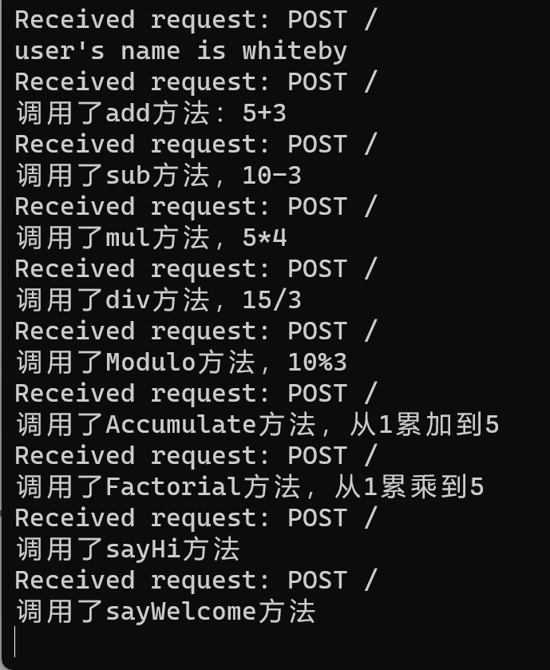

      2. consumer：

         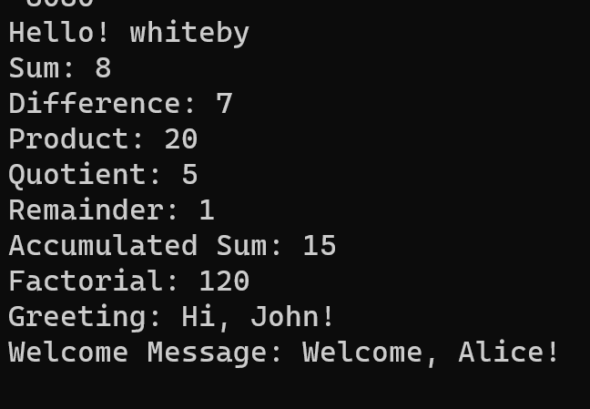

2. rpc-core服务启动（IP、port已经在全局config中配置好了。）

   1. 启动etcd服务

   2. 启动provider

      在`MyRPC\rpc-provider\src\main\java\provider`包下，启动`Provider`代码。

   3. 启动consumer

      在`MyRPC\rpc-consumer\src\main\java\consumer`包下，启动`Consumer`代码。

   4. 全流程跑通可以看见

      1. provider启动输出

      

      2. consumer服务调用输出

         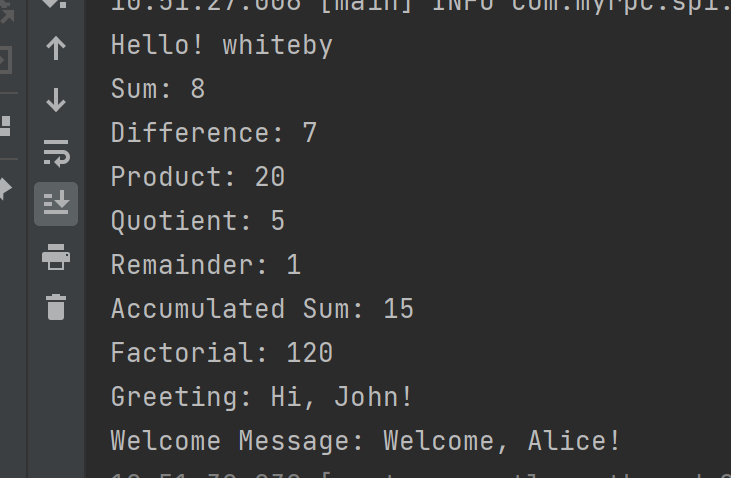

      3. provider反馈输出

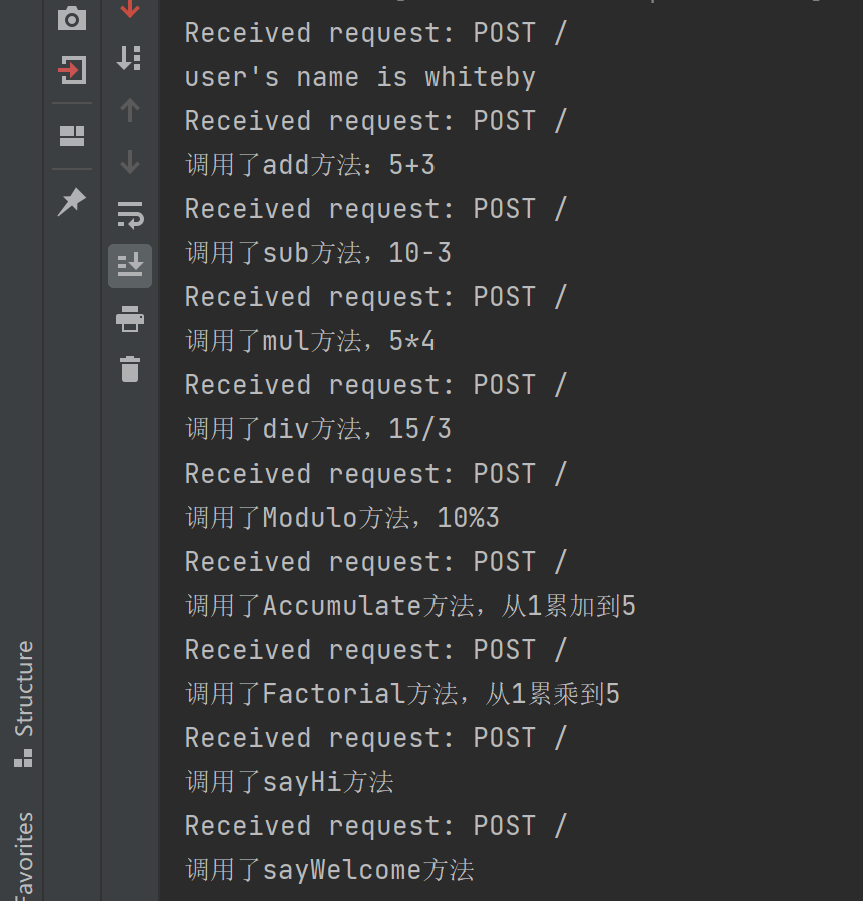

3. 单项功能测试
   1. 在`rpc-core`下`/src/test/java/com/myrpc`下，有专门的容错、负载均衡、消息协议小测试

## 详细介绍

### 1. 消息协议定义（`com.myrpc.protocol`）

1. 为了改进rpc响应速度，参考现在的HTTP协议以及Dubbo的协议设计

2. 消息格式定义

   请求头定义了魔数、版本号、消息类型、请求ID和body长度。

   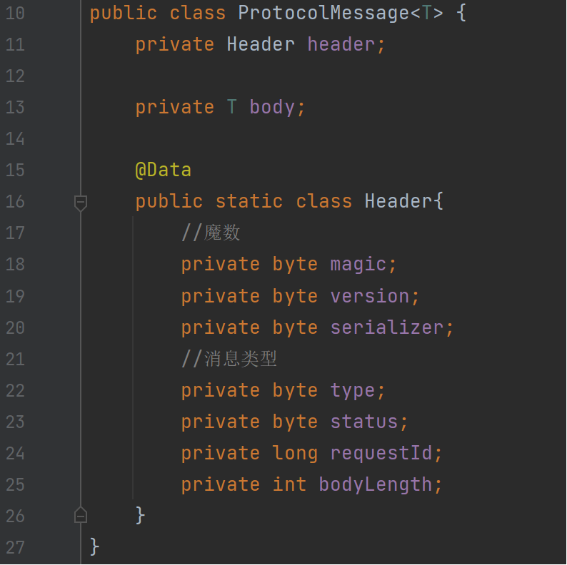

   消息头部共17字节，魔数以及版本默认为1。

   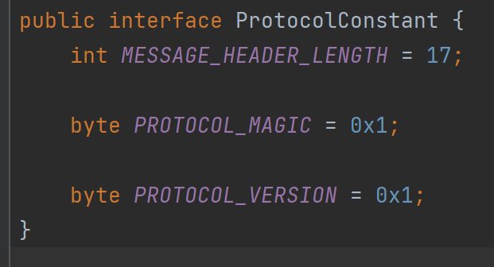

   响应的消息类型定义了请求成功、请求失败和响应失败。

   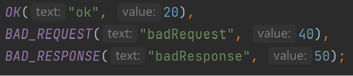

3. 编解码器

   1. 编码：一点一点向buffer缓冲区写入字段
   2. 解码：一点一点往buffer缓冲区读出字段

4. 解决buffer问题（`com.myrpc.server.tcp`）

   1. 沾包
      1. 每次只读取固定长度数据。
   2. 半包
      1. 提前设置好body长度，每次接收消息时判断长度是否符合预期，只有完整的信息才读取。

   3. 封装

      为了调用代码的简洁易读，封装成`TcpBufferHandlerWrapper`

      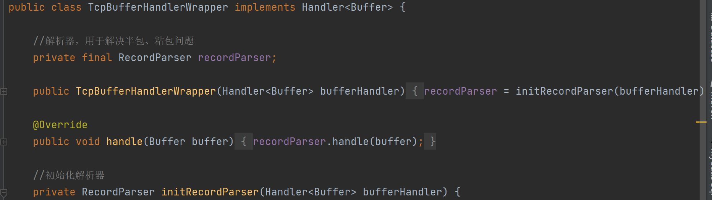

### 2. 序列化器（`com.myrpc.serializer`）

1. 实现了以下两种序列化器：

   1. JDK序列化器

   2. JSON序列化器

      1. 序列化与反序列化

         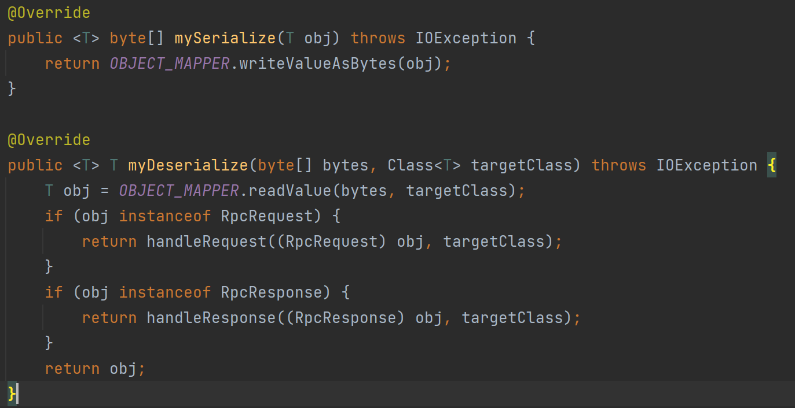

      2. 确保请求参数类型的正确性

         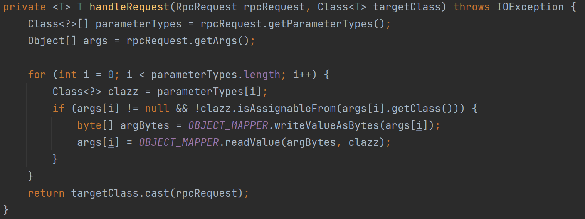

      3. 确保响应数据类型的正确性

         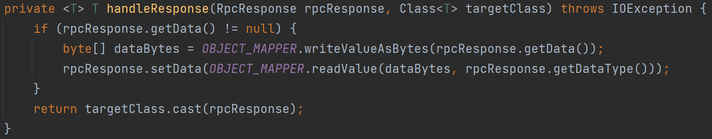

### 3. 服务注册（`com.myrpc.registry`）

服务提供者启动时，会将自己的服务信息注册到注册系统中。注册的信息包括服务名称、IP地址和端口号。注册系统会维护一个键值存储，确保服务信息的自动过期和及时清理。

1. 获取租约客户端并创建租约。

2. 设置服务元信息的键值对。

3. 将键值对与租约关联，并设置过期时间。

4. 将注册信息添加到本地缓存。

   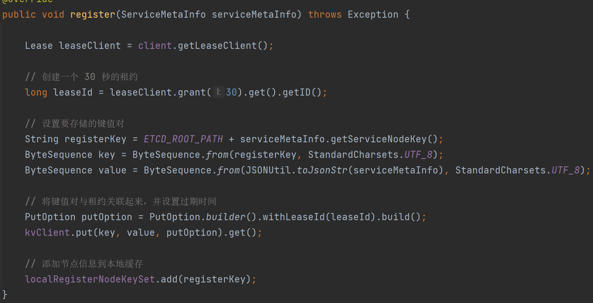

### 4. 服务启动（`com.myrpc.registry`）

服务消费者启动时，需要通过注册中心获取所需服务的地址信息。

1. 服务消费者启动：服务消费者读取配置文件，获取需要调用的服务名称。

   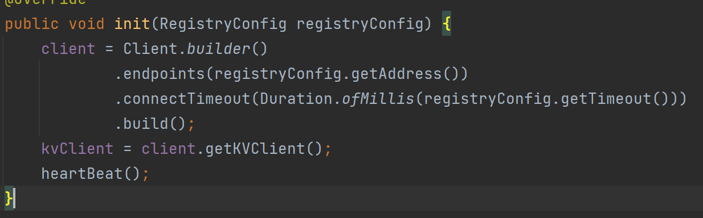

2. 服务发现：

   1. 首先尝试从本地缓存中读取服务信息，如果缓存中存在有效的服务信息，则直接返回，减少对注册系统的访问。

      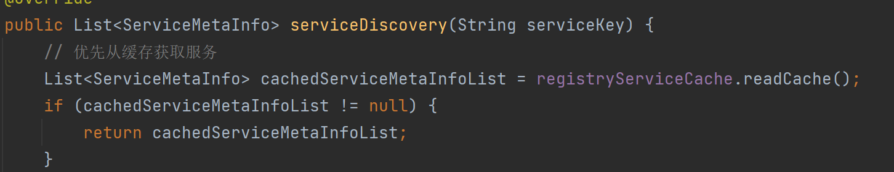

   2. 如果缓存中没有服务信息，则构建搜索前缀，并使用前缀查询获取所有匹配的键值对。

   3. 遍历查询结果，解析每个键值对中的服务信息，并监听服务节点的变化，确保服务信息的实时更新。

      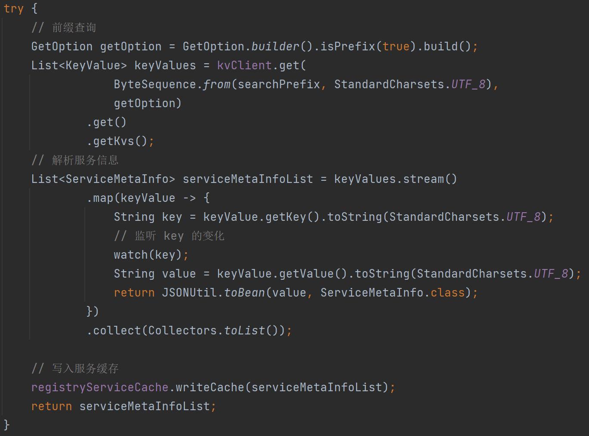

   4. 将解析得到的服务信息写入本地缓存，并返回服务信息列表。

      

3. 本地缓存：服务消费者将获取到的服务节点信息缓存到本地，以减少对注册中心的频繁请求，提高性能。

   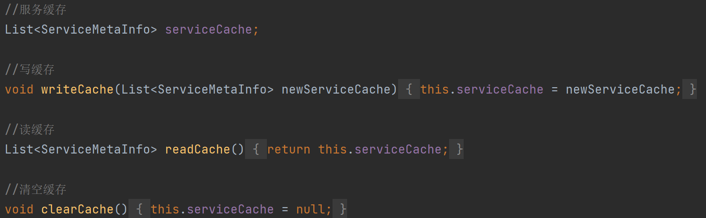

### 5. 服务优化（`com.myrpc.registry`）

服务消费者在需要调用远程服务时，从本地缓存中获取服务节点信息，并通过负载均衡策略选择一个节点进行调用。

1. 从缓存获取服务节点：消费者先从本地缓存中获取服务节点信息。如果缓存中没有或缓存已过期，则重新向注册中心请求。

2. 选择服务节点：通过负载均衡算法（如轮询、一致性哈希）选择一个合适的服务节点。

3. 发送请求：构造请求消息，包含请求头（魔数、版本号、消息类型、请求ID和body长度）和请求体（具体的服务调用参数）。

4. 接收响应：服务提供者处理请求后返回响应消息，包含响应头（请求状态）和响应体（具体的返回结果）。

5. 心跳检测

   1. 注册中心收到注册信息后，设置一个TTL（默认半分钟），过期自动删除。
   
   2. provider定期续签，重写TTL。
   
   3. 定义一个key集合用于维护续期，注册就加，注销就减。
   
      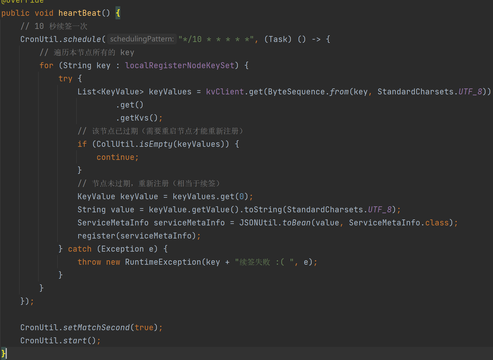
   
6. 客户端监听
   1. 消费者监听发现服务节点下线，更新缓存用。
   
   2. 为了防止监听到同一节点，维护一个set避免。
   
      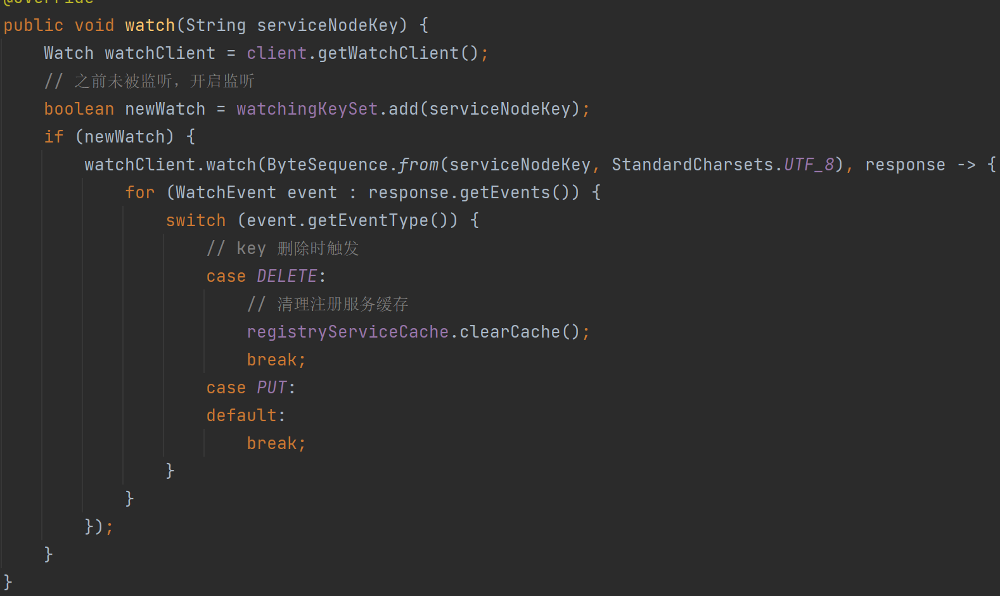

### 6. 多线程与资源释放

服务提供者和服务消费者都需要支持并发处理多个请求。

1. 双重检查锁定

   双重检查锁定用于确保 `RpcConfig` 在多线程环境下的安全初始化，可以有效地减少同步开销，同时保证线程安全。

   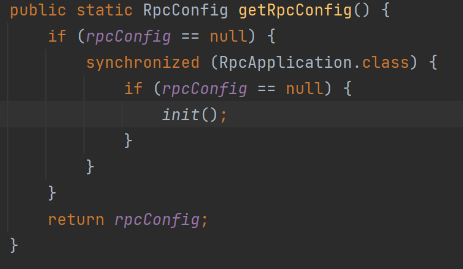

2. Shutdown Hook

   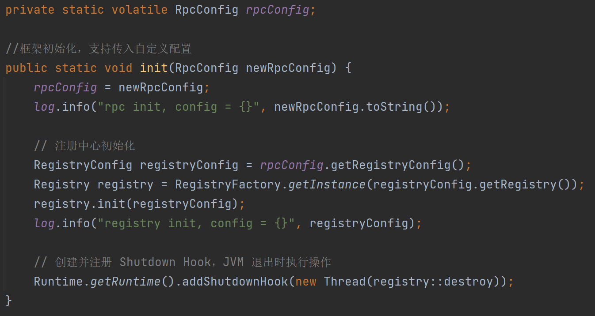

### 7. 异常处理及超时处理（`com.myrpc.exception`）

在网络通信和服务调用过程中，可能会出现各种异常情况，需要进行有效的处理。

1. 重试机制：对于某些非致命错误，可以进行重试。重试次数和间隔时间可以配置。

   1. 无重试策略在每次请求时直接执行。

      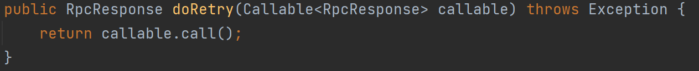

2. 超时处理：在发送请求或接收响应时设置超时时间，防止长时间等待导致资源浪费。

3. 容错机制：对于无法恢复的错误，记录日志并抛出异常，以便上层处理。

   1. 出现错误时，抛异常给外层。

      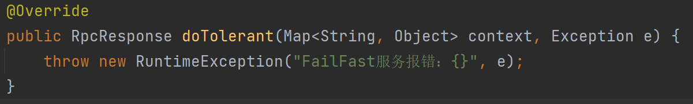

   2. 记录日志，继续执行。

      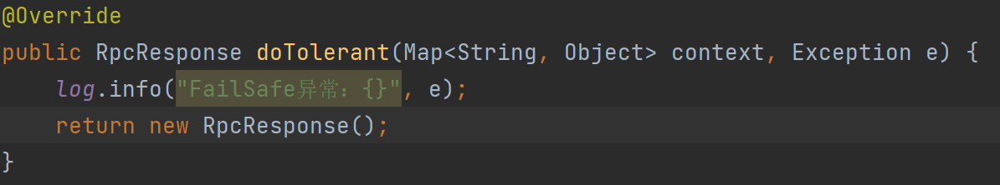

### 8. 负载均衡（`com.myrpc.loadbalancer`）

为了分散负载，服务消费者在选择服务节点时，会使用负载均衡算法。

1. 轮询算法：轮询负载均衡器通过维护一个原子计数器，按顺序循环选择服务节点。

   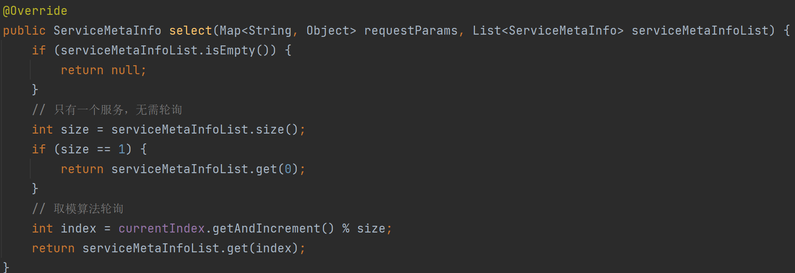

2. 一致性哈希：通过构建虚拟节点环并根据请求的哈希值选择最接近的虚拟节点，从而实现请求在服务提供者之间的均匀分配和动态扩展。

   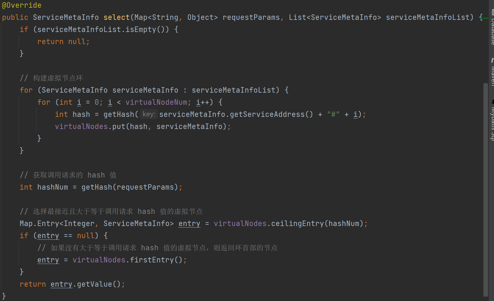